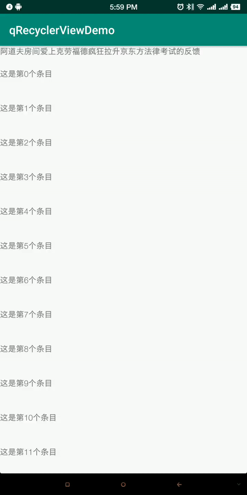

# Android智能下拉刷新框架-QSwipeRecyclerView
RecyclerView Refresh LoadMore

QSwipeRecyclerView参考了SmartRefreshLayout 和严大的SwipeRecyclerView 进行抽取和封装，提供了刷新和加载更多的功能。
提供了添加header和footer的方法，方便实现比较复杂的布局
提供了可以自定义加载刷新头的接口，可以为自己的项目设置个性的刷新和加载效果
 
#### 2.在XML布局文件中添加 QSwipeRecyclerView
```xml
<?xml version="1.0" encoding="utf-8"?>
<RelativeLayout xmlns:android="http://schemas.android.com/apk/res/android"
    android:layout_width="match_parent"
    android:layout_height="match_parent">

    <com.rv.lib.strong.QSwipeRecyclerView
        android:id="@+id/qSwipeRecyclerView"
        android:layout_width="match_parent"
        android:layout_height="match_parent" />
</RelativeLayout>
```

#### 3.在 Activity 或者 Fragment 中添加代码
```java

       设置加载更多的类型
       //SMART_LOADMORE_TYPE, // smartRefreshLayout loadMore
       //Q_RECYCLERVIEW_LOADMORE_TYPE, //qRecyclerView loadMore
       //NO_LOADMORE;//no lodmore
       qSwipeRecyclerView.setLoadMoreType(LoadMoreType.NO_LOADMORE);
      
       QSwipeRecyclerView qSwipeRecyclerView = findViewById(R.id.qSwipeRecyclerView);
       qSwipeRecyclerView.setLinearLayoutManager();

       loadMoreAdapter = new LoadMoreAdapter(this);
       qSwipeRecyclerView.setAdapter(loadMoreAdapter);
        
        
       qSwipeRecyclerView.setRefreshAndLoadMore(new RefreshAndLoadMoreListener() {
            @Override
            public void onRefresh() {
                refreshData();
            }

            @Override
            public void onLoadMore() {
            
            }
        });
```

#### 添加header\footer
```java

      TextView textView = new TextView(this);
      textView.setText("******header******");
      textView.setOnClickListener(new View.OnClickListener() {
          @Override
          public void onClick(View v) {
              Toast.makeText(RefreshLoadMoreActivity.this, "我是第一个header", Toast.LENGTH_SHORT).show();
          }
      });

      TextView textViewFooter = new TextView(this);
      textViewFooter.setText("*****footer*********");
      textViewFooter.setOnClickListener(new View.OnClickListener() {
          @Override
          public void onClick(View v) {
              Toast.makeText(RefreshLoadMoreActivity.this, "我是第一个footer", Toast.LENGTH_SHORT).show();
          }
      });

      qSwipeRecyclerView.addHeaderView(textView);
      qSwipeRecyclerView.addFooterView(textViewFooter);
```

#### 效果图

